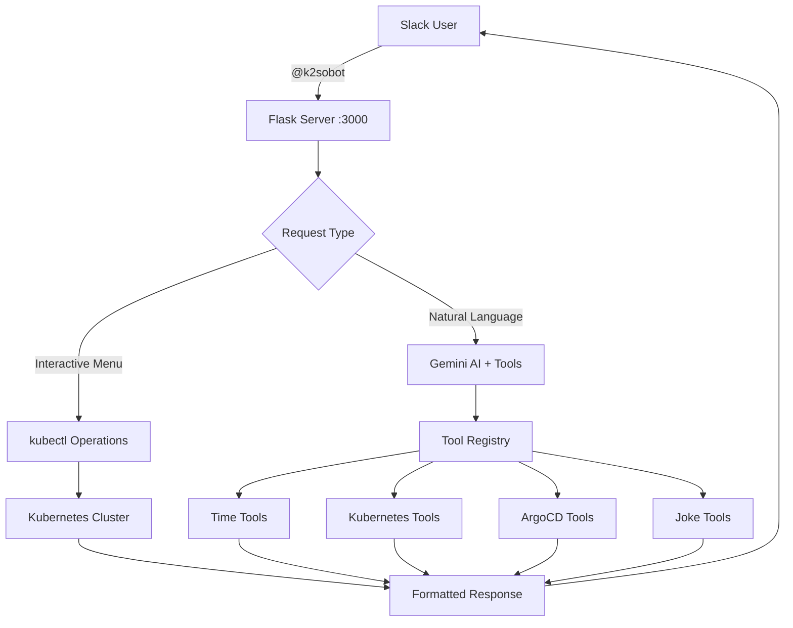

    # K2SOBot 🤖⚓

[](https://python.org)
[](https://flask.palletsprojects.com/)

> 🚀 **AI-Powered Slack Bot for Kubernetes & GitOps Operations** 
> 
> Combines interactive kubectl operations with Google Gemini AI for natural language DevOps interactions.

> ** Examples of using tools powered by Gemini LLM

## ✨ Features

🤖 **AI-Powered Chat** - Natural language conversations with Google Gemini 2.5 Flash Lite  
⚓ **Kubernetes Management** - Interactive kubectl operations via Slack UI  
🚀 **GitOps Integration** - ArgoCD application management and monitoring  
🛠️ **Modular Tools** - Auto-discovering tool system for easy extensibility  
🔐 **Security First** - Non-root Docker container with proper permissions  
⚡ **Real-time** - Instant responses via Slack webhooks and ngrok tunneling  

## 🏗️ Architecture



## 🚀 Quick Start

### Prerequisites

- 🐍 **Python 3.13+**
- ⚓ **kubectl** configured with cluster access
- 🚀 **ArgoCD CLI** (optional, for GitOps features)
- 🌐 **ngrok** (for Slack webhook tunneling)
- 💬 **Slack workspace** with admin permissions


### 🐍 Local Development

```bash
# Clone and setup
git clone https://github.com/red512/k2sobot.git
cd k2sobot

# Create virtual environment
python3 -m venv env
source env/bin/activate  # Windows: env\Scripts\activate

# Install dependencies
pip install -r requirements.txt

# Set environment variables
export SLACK_SIGNING_SECRET="your_slack_signing_secret"
export SLACK_BOT_TOKEN="xoxb-your_bot_token"
export VERIFICATION_TOKEN="your_verification_token"
export GEMINI_API_KEY="your_gemini_api_key"

# Run the bot
python3 main.py
```

# Run with environment variables
docker run -d \
  -p 3000:3000 \
  -e SLACK_SIGNING_SECRET="your_slack_signing_secret" \
  -e SLACK_BOT_TOKEN="xoxb-your_bot_token" \
  -e VERIFICATION_TOKEN="your_verification_token" \
  -e GEMINI_API_KEY="your_gemini_api_key" \
  --name k2sobot \
  k2sobot
```


## ⚙️ Slack App Setup

### 1. Create Slack App
1. Go to [Slack API Apps](https://api.slack.com/apps)
2. Click **"Create New App"** → **"From scratch"**
3. Name: `K2SOBot`, select your workspace

### 2. Configure Bot Scopes
Navigate to **OAuth & Permissions** and add these scopes:
```
app_mentions:read
chat:write
commands
im:read
im:write
im:history
```

### 3. Setup Webhooks
```bash
# For local testing only
ngrok http 3000
```

> **⚠️ Note:** ngrok is for testing only. Production needs proper domain.

Copy the HTTPS URL and configure in your Slack app:

**Event Subscriptions:**
- Request URL: `https://your-ngrok-url.ngrok-free.app/slack/events`
- Bot events: `app_mention`, `message.im`

**Interactivity & Shortcuts:**
- Request URL: `https://your-ngrok-url.ngrok-free.app/interactions`

**Slash Commands:**
- Command: `/k2sobot`
- Request URL: `https://your-ngrok-url.ngrok-free.app/k2sobot`

## 📱 Usage Examples

### Interactive kubectl Menu
```
/k2sobot
```
or
```
@k2sobot
```

Both trigger an interactive menu:
1. **Select operation** → `get`, `describe`, `logs`, `rollout restart`
2. **Choose resource** → `pods`, `services`, `deployments`, `nodes`
3. **Pick namespace** → Dynamic list of available namespaces
4. **Select resource** → Real-time filtered list
5. **Get results** → Formatted output in Slack

> ** Examples of interactive commands**

argo rollout command


argo app status


### AI Chat (Direct Messages)
**Natural Language Examples:**
show namespaces


show pods


## 🛠️ Available Tools

<details>
<summary><strong>⏰ Time & Utility Tools</strong></summary>

- `get_current_time()` - Current date, time, and day of week
- `get_random_joke()` - Programming humor for team morale

</details>

<details>
<summary><strong>⚓ Kubernetes Tools</strong></summary>

- `get_namespaces()` - List all available namespaces
- `get_pods(namespace)` - List pods in specific namespace
- `get_deployments(namespace)` - List deployments with status
- `get_pod_logs(pod_name, namespace, lines)` - Retrieve pod logs
- `describe_pod(pod_name, namespace)` - Detailed pod information

</details>

<details>
<summary><strong>🚀 ArgoCD GitOps Tools</strong></summary>

- `get_applications()` - List all ArgoCD applications
- `get_application_status(app_name)` - Get application sync/health status
- `get_application_history(app_name)` - Get application revision history
- `get_application_revisions(app_name)` - Get available revisions for rollback
- `sync_application(app_name, revision)` - Sync application with optional revision

</details>

## 🔧 Adding Custom Tools

K2SOBot uses an **auto-discovery tool system**. Adding new functionality is simple:

### 1. Create Tool File
Simply create a new Python file in the `tools/` directory:

```python
# tools/my_custom_tools.py
def example_tool():
    """
    Example tool showing how to create custom functionality
    
    Returns:
        Simple example output
    """
    # Your tool logic here
    return "Hello tool!"
```

### 2. Restart Bot
That's it! The tool will be **automatically discovered** and available to Gemini AI.

> **✨ Auto-Discovery:** No imports or registration needed. The registry scans all `.py` files in `tools/` directory.

### 🐍 Local Development

```bash
# Clone and setup
git clone https://github.com/red512/k2sobot.git
cd k2sobot

# Create virtual environment
python3 -m venv env
source env/bin/activate  # Windows: env\Scripts\activate

# Install dependencies
pip install -r requirements.txt

# Set environment variables
export SLACK_SIGNING_SECRET="your_slack_signing_secret"
export SLACK_BOT_TOKEN="xoxb-your_bot_token"
export VERIFICATION_TOKEN="your_verification_token"
export GEMINI_API_KEY="your_gemini_api_key"

# Run the bot
python3 main.py
```

## 📊 Project Structure

```
k2sobot/
├── 🚀 argo.py                  # ArgoCD operations wrapper
├── 🐳 Dockerfile              # Production container config
├── 📋 requirements.txt        # Python dependencies
├── 🌐 main.py                 # Flask app & Slack handlers
├── 🤖 gemini_integration.py   # AI chat with function calling
├── 🛠️ handlers.py             # Interactive Slack components
├── ⚓ k8s.py                  # Kubernetes operations wrapper
├── 💬 slack_blocks.py         # Slack UI block builders
├── 🔗 shared_state.py         # Cross-module state management
└── 🧰 tools/                  # Modular tool system
    ├── 📝 __init__.py
    ├── 🔍 registry.py          # Auto-discovery engine
    ├── ⏰ time_tools.py         # Time utilities
    ├── 😄 joke_tools.py         # Programming humor
    ├── ⚓ k8s_tools.py          # Kubernetes operations
    └── 🚀 argo_tool.py         # ArgoCD GitOps tools
```

<div align="center">

</div>
